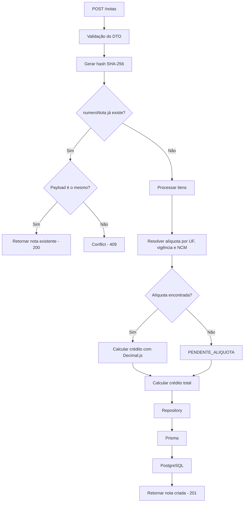

# CloudGed — API de Créditos ICMS-ST

## Visão geral do desafio

A CloudGed realiza a apuração de créditos de ICMS-ST a partir de notas fiscais. O objetivo deste projeto foi transformar um processo de cálculo manual em uma API capaz de **receber os itens de uma nota já estruturados, identificar a alíquota correta, calcular o crédito, persistir o resultado e permitir sua consulta posterior**.

### A dor

O cálculo não depende apenas de uma alíquota fixa. Para cada item é necessário considerar:

- a **UF** da nota;
- a **data de emissão**;
- a **vigência** da regra;
- o **NCM** do item;
- a regra de NCM **mais específica** disponível.

Além disso, a API precisa continuar processando a nota quando um item não possui alíquota compatível e deve evitar duplicidades quando a mesma nota é enviada novamente ou quando duas requisições chegam ao mesmo tempo.

### A solução

A solução foi dividida em responsabilidades bem definidas:

| Responsabilidade      | Solução adotada                              |
| --------------------- | -------------------------------------------- |
| Entrada e validação   | DTOs + `ValidationPipe`                      |
| Resolução da alíquota | `AliquotaResolverService`                    |
| Cálculo monetário     | Entidades + `Decimal.js`                     |
| Persistência          | Repository Pattern + Prisma + PostgreSQL     |
| Idempotência          | `numeroNota` único + hash SHA-256 do payload |
| Concorrência          | Constraint `UNIQUE` no PostgreSQL            |
| Autenticação          | JWT + `bcrypt`                               |
| Autorização           | `AuthGuard` + `RolesGuard`                   |
| Testes                | Jest + Supertest                             |

### Exemplo do problema

Uma requisição pode conter itens que encontram uma regra de alíquota e outros que não encontram:

```json
{
  "numeroNota": "12345",
  "uf": "SP",
  "dataEmissao": "2024-06-01",
  "itens": [
    {
      "ncm": "1006.30.00",
      "quantidade": 10,
      "valorUnitario": 50
    },
    {
      "ncm": "9999.99.99",
      "quantidade": 5,
      "valorUnitario": 20
    }
  ]
}
```

A aplicação calcula normalmente os itens que possuem alíquota e mantém os demais como pendentes:

```json
{
  "numeroNota": "12345",
  "creditoTotal": 20,
  "itens": [
    {
      "ncm": "1006.30.00",
      "aliquota": 0.04,
      "credito": 20
    },
    {
      "ncm": "9999.99.99",
      "status": "PENDENTE_ALIQUOTA"
    }
  ]
}
```

Dessa forma, a ausência de uma alíquota em um item não impede o processamento dos demais.

---

## Arquitetura

O projeto utiliza a estrutura modular do NestJS, separando as regras de negócio da infraestrutura de persistência e dos detalhes de autenticação.

```text
src/
├── database/
│   ├── prisma.module.ts
│   └── prisma.service.ts
│
├── generated/
│   └── prisma/
│
├── modules/
│   ├── aliquotas/
│   │   ├── entities/
│   │   ├── repositories/
│   │   │   └── prisma/
│   │   ├── services/
│   │   └── aliquotas.module.ts
│   │
│   ├── auth/
│   │   ├── controllers/
│   │   ├── decorators/
│   │   ├── dto/
│   │   ├── guards/
│   │   ├── services/
│   │   └── auth.module.ts
│   │
│   ├── notas/
│   │   ├── controllers/
│   │   ├── dto/
│   │   │   ├── request/
│   │   │   └── response/
│   │   ├── entities/
│   │   ├── enums/
│   │   ├── repositories/
│   │   │   └── prisma/
│   │   ├── services/
│   │   └── notas.module.ts
│   │
│   └── user/
│       ├── entities/
│       ├── enums/
│       ├── repositories/
│       │   └── prisma/
│       └── user.module.ts
│
├── shared/
│   └── errors/
│
├── app.module.ts
└── main.ts

prisma/
├── migrations/
└── schema.prisma

test/
├── notas.e2e-spec.ts
└── notas-concurrency.e2e-spec.ts
```

### Responsabilidade de cada área

#### `src/modules/notas`

É o núcleo do fluxo de processamento das notas.

O `NotasController` recebe as requisições HTTP e delega a execução aos services.

O `NotasService` coordena a criação da nota:

1. gera o hash do payload;
2. verifica se o `numeroNota` já existe;
3. resolve as alíquotas dos itens;
4. calcula os créditos;
5. calcula o crédito total;
6. persiste a nota e seus itens;
7. trata possíveis colisões causadas por requisições concorrentes.

Os casos de consulta ficam separados em `FindAllNotasService` e `FindNotaService`.

#### `src/modules/aliquotas`

Concentra a regra de resolução das alíquotas.

O `AliquotaResolverService` recebe:

```json
{
  "uf": "SP",
  "ncm": "1006.30.00",
  "dataEmissao": "2024-06-01"
}
```

e procura uma regra que esteja vigente e cujo prefixo seja compatível com o NCM informado.

Quando existem várias regras compatíveis, a de maior especificidade é utilizada.

Exemplo:

```text
SP / 10         → compatível
SP / 1006.30.00 → compatível e mais específica
```

Resultado:

```json
{
  "ncm": "1006.30.00",
  "aliquota": 0.04
}
```

#### `src/modules/auth`

Responsável pelo login e proteção das rotas.

O `AuthService` consulta o usuário, valida a senha com `bcrypt` e gera o token JWT.

```json
{
  "usuario": "ana",
  "senha": "operador123"
}
```

Resposta:

```json
{
  "role": "operador",
  "access": "<jwt>"
}
```

O `AuthGuard` valida o Bearer Token e o `RolesGuard` verifica se a role possui acesso ao endpoint solicitado.

#### `src/modules/user`

Contém a entidade `User`, o enum `UserRole` e a abstração de acesso aos usuários.

A implementação `PrismaUserRepository` mantém o acesso ao banco separado do serviço de autenticação.

#### `src/database`

Centraliza a configuração de acesso ao PostgreSQL através do Prisma.

O `PrismaService` disponibiliza o client utilizado pelas implementações concretas dos repositories.

#### `src/generated`

Contém o Prisma Client gerado a partir do `schema.prisma`.

Essa pasta é gerada automaticamente e não contém regras de negócio.

#### `src/shared/errors`

Mantém os erros compartilhados pela aplicação, como `AppError` e `ErrorCode`, evitando duplicação dessas definições entre os módulos.

#### `prisma`

Contém:

- definição dos models;
- relacionamentos;
- índices;
- constraints;
- migrations;
- dados de referência utilizados pelo desafio.

#### `test`

Contém os testes E2E, incluindo os cenários de integração e concorrência.

Os testes unitários ficam próximos às regras testadas dentro de `src`, como os testes da resolução de alíquota e do cálculo de crédito.

---

## Fluxo principal



### Separação das camadas

O fluxo entre as principais responsabilidades segue:

```text
Controller
    ↓
Service
    ↓
Repository
    ↓
Prisma
    ↓
PostgreSQL
```

Os controllers ficam responsáveis pelo protocolo HTTP, enquanto os services coordenam os casos de uso. Os repositories funcionam como abstrações de persistência e suas implementações Prisma concentram os detalhes de acesso ao banco.

Essa separação evita que as regras da aplicação dependam diretamente do ORM e facilita a criação de testes isolados.

---

## Tecnologias

- Node.js
- TypeScript
- NestJS
- PostgreSQL
- Prisma
- Docker / Docker Compose
- JWT
- bcrypt
- Decimal.js
- Jest / Supertest
- Swagger

---

## Como rodar

### Pré-requisitos

- Node.js 20.19+ (recomendado Node.js 22 LTS)
- Docker
- Docker Compose

### 1. Instale as dependências

```bash
npm install
```

### 2. Inicie a aplicação

```bash
npm run dev
```

O comando prepara automaticamente o ambiente:

- sobe o PostgreSQL com Docker Compose;
- aguarda o banco ficar disponível;
- gera o Prisma Client;
- aplica as migrations;
- inicia a aplicação NestJS em modo de desenvolvimento.

A API estará disponível em:

```text
http://localhost:3000
```

A documentação Swagger estará disponível em:

```text
http://localhost:3000/docs
```

### 3. Execute os testes

Em outro terminal:

```bash
npm test
```

O comando executa os testes unitários e E2E, incluindo os cenários de cálculo, integração, idempotência e concorrência.

---

## Autenticação e autorização

A API utiliza autenticação via JWT e possui dois papéis:

| Papel      | Criar/calcular notas | Consultar notas |
| ---------- | -------------------: | --------------: |
| `operador` |                  Sim |             Não |
| `auditor`  |                  Não |             Sim |

O papel do usuário é incluído no token JWT e utilizado para autorização das rotas.

### Operador

Pode criar, calcular notas

```text
POST /notas

```

Credenciais para teste:

```json
{
  "usuario": "ana",
  "senha": "operador123"
}
```

### Auditor

Possui acesso somente de leitura.

```text
GET /notas
GET /notas/:numeroNota
```

O auditor não possui permissão para executar:

```text
POST /notas
```

Caso tente criar uma nota, a API retorna:

```text
403 Forbidden
```

Credenciais para teste:

```json
{
  "usuario": "carlos",
  "senha": "auditor123"
}
```

### Login

```http
POST /auth/login
```

Exemplo de resposta:

```json
{
  "role": "operador",
  "access": "<jwt>"
}
```

---

## Endpoints

| Método | Endpoint             | Operador | Auditor |
| ------ | -------------------- | -------: | ------: |
| POST   | `/auth/login`        |      Sim |     Sim |
| POST   | `/notas`             |      Sim |     Não |
| GET    | `/notas`             |      Não |     Sim |
| GET    | `/notas/:numeroNota` |      Não |     Sim |

---

## Exemplo de requisição

```http
POST /notas
Authorization: Bearer <jwt>
Content-Type: application/json
```

```json
{
  "numeroNota": "12345",
  "uf": "SP",
  "dataEmissao": "2024-06-01",
  "itens": [
    {
      "ncm": "1006.30.00",
      "quantidade": 10,
      "valorUnitario": 50
    },
    {
      "ncm": "2203.00.00",
      "quantidade": 4,
      "valorUnitario": 30
    },
    {
      "ncm": "9999.99.99",
      "quantidade": 5,
      "valorUnitario": 20
    }
  ]
}
```

Exemplo de resposta:

```json
{
  "numeroNota": "12345",
  "creditoTotal": 32,
  "itens": [
    {
      "ncm": "1006.30.00",
      "aliquota": 0.04,
      "credito": 20
    },
    {
      "ncm": "2203.00.00",
      "aliquota": 0.1,
      "credito": 12
    },
    {
      "ncm": "9999.99.99",
      "status": "PENDENTE_ALIQUOTA"
    }
  ]
}
```

---

## Regra de cálculo

O crédito de cada item é calculado por:

```text
credito = quantidade × valorUnitario × aliquota
```

Quando nenhuma alíquota compatível é encontrada, o item é marcado como:

```text
PENDENTE_ALIQUOTA
```

sem impedir o cálculo dos demais itens da nota.

---

## Resolução da alíquota

As alíquotas são resolvidas considerando:

1. UF da nota;
2. data de emissão;
3. prefixo compatível do NCM;
4. maior especificidade entre as regras encontradas.

Os prefixos podem possuir 2, 4, 6 ou 8 dígitos.

Exemplo:

```text
SP / 10         → 3%
SP / 1006.30.00 → 4%
```

Para o NCM:

```text
1006.30.00
```

as duas regras são compatíveis, porém a regra de 8 dígitos é mais específica, portanto a alíquota aplicada é `4%`.

A normalização do NCM é utilizada internamente apenas para comparação dos prefixos. O valor recebido é preservado para persistência e retorno da API.

---

## Vigência

A vigência é tratada de forma inclusiva:

```text
dataInicio <= dataEmissao
```

Quando existir `dataFim`:

```text
dataEmissao <= dataFim
```

Portanto:

```text
dataInicio <= dataEmissao <= dataFim
```

Quando `dataFim` não existir, a alíquota permanece válida a partir de `dataInicio`.

---

## Arredondamento monetário

Os cálculos utilizam `Decimal.js`.

O crédito de cada item é arredondado para duas casas decimais utilizando:

```text
ROUND_HALF_UP
```

Exemplo:

```text
100.05 × 10% = 10.005
```

Resultado:

```text
10.01
```

---

## Idempotência e concorrência

O campo `numeroNota` possui uma constraint única no PostgreSQL.

Também é armazenado um hash SHA-256 determinístico do payload para identificar o conteúdo da requisição.

### Mesmo número + mesmo payload

Retorna o resultado já persistido:

```text
200 OK
```

sem duplicar nem recalcular a nota.

### Mesmo número + payload diferente

Retorna:

```text
409 Conflict
```

A constraint única no banco garante que o comportamento continue correto mesmo quando duas requisições são executadas simultaneamente.

---

## Tratamento de erros

Principais respostas da API:

| Status | Situação                                 |
| -----: | ---------------------------------------- |
|  `400` | Payload inválido                         |
|  `401` | Token ausente, inválido ou expirado      |
|  `403` | Usuário sem permissão                    |
|  `404` | Nota não encontrada                      |
|  `409` | Mesmo `numeroNota` com payload diferente |
|  `500` | Erro interno inesperado                  |

---

## Decisões técnicas

### PostgreSQL

Foi utilizado PostgreSQL para persistência e para garantir integridade sob concorrência através da constraint única de `numeroNota`.

### Prisma

O Prisma foi utilizado como camada de acesso ao banco, oferecendo migrations, integração com TypeScript e tipagem das consultas.

### Repository Pattern

Os serviços dependem de abstrações de repository, evitando acoplamento direto entre as regras da aplicação e o Prisma.

Fluxo principal:

```text
Controller → Service → Repository → Prisma → PostgreSQL
```

### Decimal.js

Foi utilizado para evitar problemas de precisão de ponto flutuante nos cálculos monetários.

### JWT e roles

O `AuthGuard` valida o token JWT e o `RolesGuard` controla as permissões.

O `operador` pode criar e calcular notas, enquanto o `auditor` possui exclusivamente permissão de consulta.

### Idempotência

A combinação de constraint única no banco e hash determinístico do payload permite diferenciar um reenvio idempotente de um conflito de conteúdo, inclusive sob concorrência.

---

## Simplificações e trade-offs

Para manter o foco nos requisitos principais, as alíquotas são mantidas como dados de referência persistidos pelas migrations, sem um CRUD para gerenciamento.

O reprocessamento automático de itens `PENDENTE_ALIQUOTA` após a inclusão de uma nova regra também não foi implementado.

O endpoint `GET /notas` foi mantido sem paginação devido ao escopo reduzido do desafio.

---

## O que faria diferente com mais tempo

O primeiro passo seria implementar o gerenciamento das alíquotas e, a partir dele, o reprocessamento seguro dos itens `PENDENTE_ALIQUOTA` afetados por novas regras.

Em uma evolução para produção também adicionaria paginação e filtros nas consultas, logs estruturados, observabilidade e uma cobertura maior de testes de integração.

---

## Testes

Os testes são executados através de:

```bash
npm test
```

São cobertos cenários de:

- cálculo do crédito;
- hierarquia de NCM;
- vigência;
- item sem alíquota;
- arredondamento;
- integração com o endpoint;
- idempotência;
- concorrência.

No cenário de concorrência, duas requisições simultâneas com o mesmo payload resultam em apenas uma nota persistida.

---

## Perguntas do desafio

### 1. Qual foi a decisão técnica mais importante que você tomou neste desafio, e por quê?

A principal decisão foi garantir a idempotência e a concorrência utilizando uma constraint única em `numeroNota` combinada com um hash determinístico do payload. Assim, a consistência não depende apenas de verificações na aplicação e permanece correta mesmo com requisições simultâneas.

### 2. Como você garantiria que a resolução de alíquota está correta exatamente nos limites da vigência? Que casos de teste você priorizaria?

Eu testaria principalmente as datas de limite da vigência: no `dataInicio` a regra já deve ser válida e no `dataFim` ainda deve ser válida. Também testaria um dia antes do início, um dia depois do fim e uma alíquota sem `dataFim`, que deve continuar válida após a data inicial.

### 3. O que você simplificou por causa do tempo, e qual seria o primeiro passo para evoluir isso em produção?

Por causa do tempo, mantive o `Decimal.js` sendo utilizado diretamente em uma entitade para os cálculos monetários e deixei a listagem de notas sem paginação. Em produção, isolaria primeiro a lógica monetária em um Value Object ou abstração de domínio, evitando o acoplamento direto à biblioteca, e adicionaria paginação ao `GET /notas` para suportar um volume maior de dados.

---

## Diferenciais

Além dos requisitos obrigatórios, foram utilizados:

- PostgreSQL via Docker;
- Swagger
